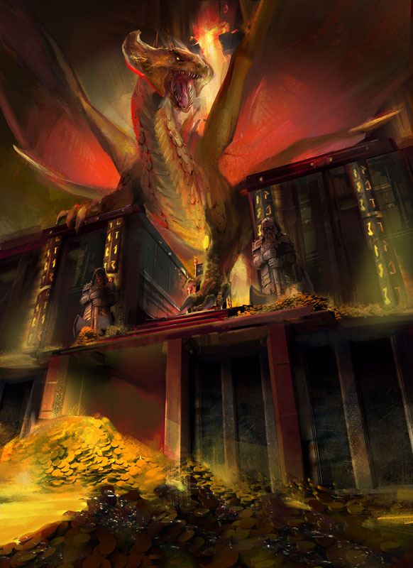
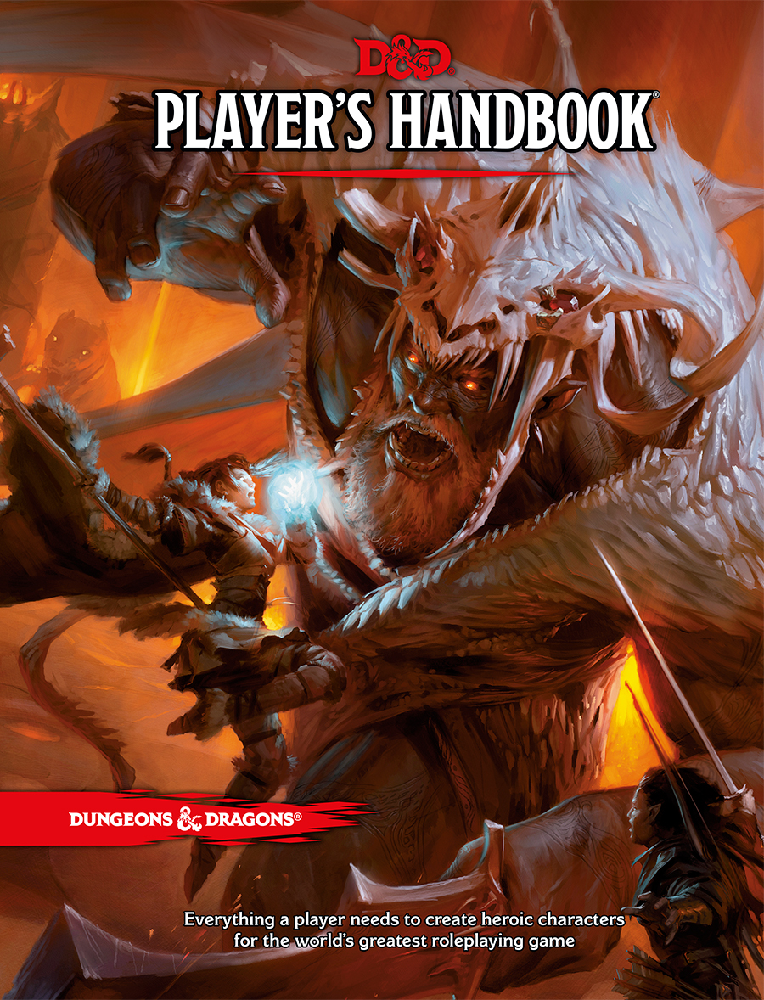
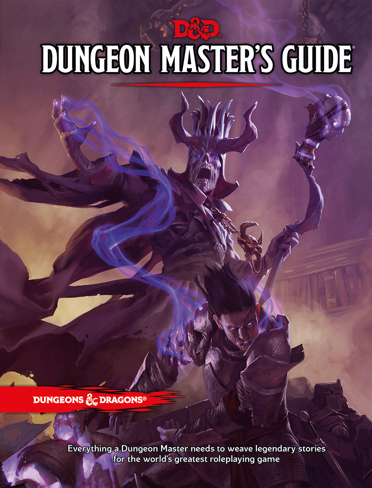
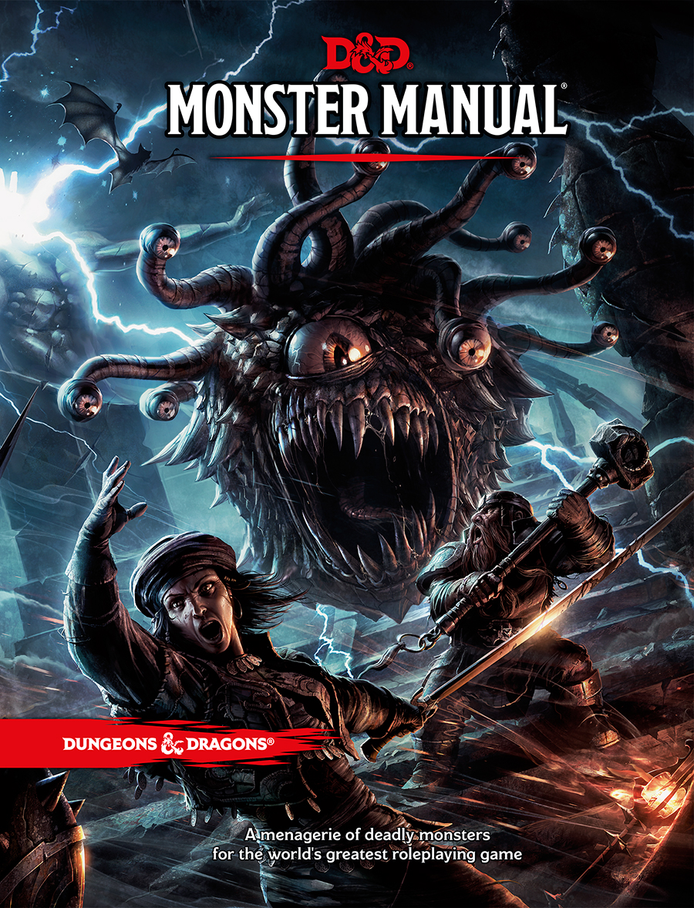

============
Introduction
============

** Latest Update: Remastered SRD v0.2.1 November 4th, 2019
<https://ogl-srd5.com/changelog#november4th2019> **

   REmastered Logo

   Fan Site Kit Image

** Welcome to the online Dungeons & Dragons 5th Edition System
 Reference Document (SRD) v5.1 Remastered in Markdown Format! **

--------------

**The Systems Reference Document (SRD)** contains guidelines for
publishing content under the Open-Gaming License (OGL). The `Dungeon
Masters Guild <http://dungeonmastersguild.com/>`__ also provides
self-publishing opportunities for individuals and groups. The OGL and
Dungeon Masters Guild offer different kinds of publishing opportunities.
For an overview of the programs, please visit the official `Wizards SRD
page <http://dnd.wizards.com/articles/features/systems-reference-document-srd>`__
to compare the programs.

**Why Markdown format?** Markdown is a lightweight markup language with
plain text formatting syntax created by `John
Gruber <https://daringfireball.net>`__. It is designed so that it can be
converted to HTML and many other formats using any number of various
Markdown editors. Markdown is often used to format readme files, for
writing books, blogs and messages, or to simply create rich text using a
plain text or markkdown editor.

! The documents contained herein are edited from scratch into Markdown
format for import into other formats or into your own 5E projects. This
is not a simple export as you find elsewhere, we have painstakingly
remastered the original Wizard's SRD PDF to markdown
paragraph-by-paragraph and **includes all errata from Nov 2018**. The
original documents can be downloaded from my `Github OGL-SRD
Repository <https://github.com/Umbyology/OGL-SRD5>`__. Please report any
issues you find through our Github account.

Features
^^^^^^^^

1. **Powerful search engines** for the D&D 5E SRD using our standard
   highlight search field (upper-left sidebar), or use the recommended
   *TNT Search*, an advanced full-text search feature (also upper-left
   sidebar), or your can perform a `custom Google
   search <https://cse.google.com/cse?cx=001286843246981938841:_5jzoxwanvq>`__
   of the SRD.
2. **Error reporting** is available directly through Github. Links can
   be found in the upper right-hand corner of each page. **NOTE:** *A
   free Github account/membership is required*.

Downloads
^^^^^^^^^

-  View the remastered `SRD v5.1 raw data in Mardown format (full
   compilation) <https://raw.githubusercontent.com/Umbyology/OGL-SRD5/master/formats/markdown/D%26D%205E%20SRD%20Full%20Compile-v0.2.1.md>`__.
-  Download the remastered `SRD v5.1 in Markdown format (full
   compilation) <https://github.com/Umbyology/OGL-SRD5/raw/master/formats/markdown/D%26D%205E%20SRD%20Full%20Compile-v0.2.1.md>`__.
-  Download the remastered `SRD v5.1 in DOCX format (full
   compilation) <https://github.com/Umbyology/OGL-SRD5/tree/master/formats/docx>`__.
-  Download the official `SRD v5.1 in PDF
   format <http://media.wizards.com/2016/downloads/DND/SRD-OGL_V5.1.pdf>`__
-  Download the official `Errata and FREE Basic
   Rules <http://dnd.wizards.com/articles/features/basicrules>`__.
-  Download the official `Characters
   Sheets <http://dnd.wizards.com/articles/features/character_sheets>`__.

Official D&D Core Rule Books
^^^^^^^^^^^^^^^^^^^^^^^^^^^^

\|

.. raw:: html

   

`Player's
Handbook <https://www.amazon.com/Players-Handbook-Dungeons-Dragons-Wizards/dp/0786965606/ref=asap_bc?ie=UTF8>`__

.. raw:: html

   

\|

.. raw:: html

   

`Dungeon Master's
Guide <https://www.amazon.com/Dungeon-Masters-Guide-Core-Rulebook/dp/0786965622/ref=asap_bc?ie=UTF8>`__

.. raw:: html

   

\|

.. raw:: html

   

`Monster
Manual <https://www.amazon.com/Monster-Manual-Core-Rulebook-Wizards/dp/0786965614/ref=asap_bc?ie=UTF8>`__

.. raw:: html

   

+---------+---------+--------+
| |PHB|   | |DMG|   | |MM|   |
+---------+---------+--------+

.. raw:: html

   

© 2015 Wizards. All Rights Reserved. Dungeons & Dragons® is a
trademark[s] of Wizards of the Coast. For more information about Wizards
of the Coast or any of Wizards' trademarks or other intellectual
property, please visit their website at
`www.wizards.com <http://www.wizards.com>`__.

Website, markdown conversion and extended formats by `B.A.
Umberger <http://www.umbyology.com>`__ in cooperation with `Juxtagames,
LLC <http://www.juxta.games>`__. By permission, this website utilizes
official material and images from the `Wizard's Fan Site
Kit <http://dnd.wizards.com/articles/features/fan-site-kit>`__. Wizards
of the Coast, Dungeons & Dragons, and their logos are trademarks of
Wizards of the Coast LLC in the United States and other countries.

